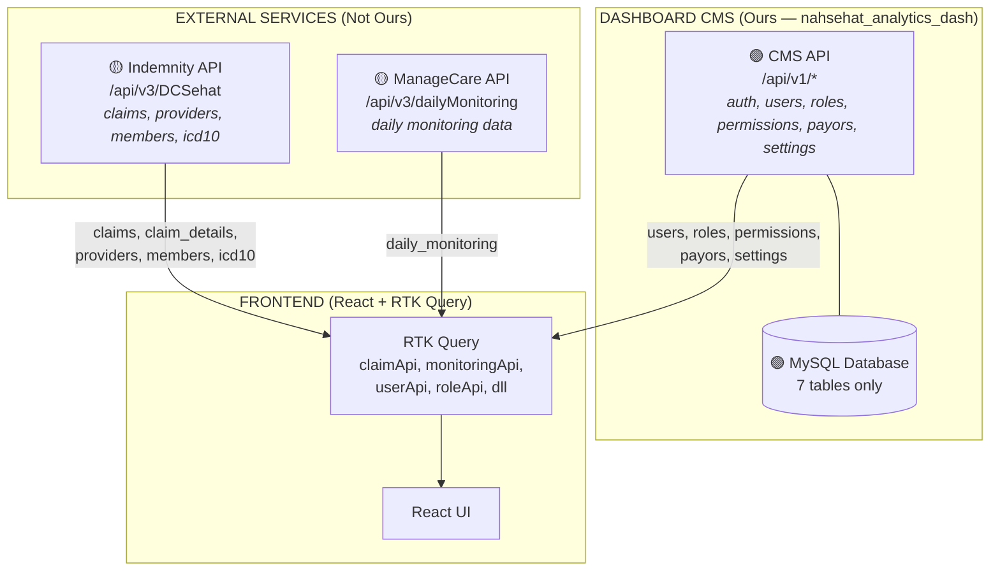
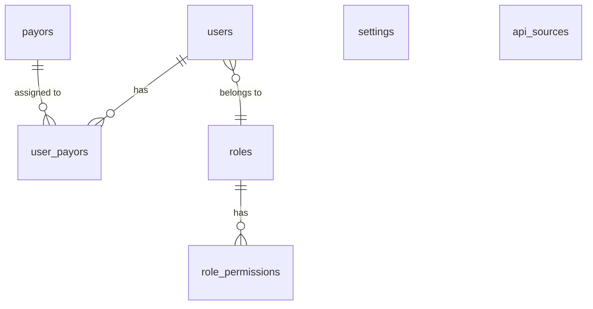
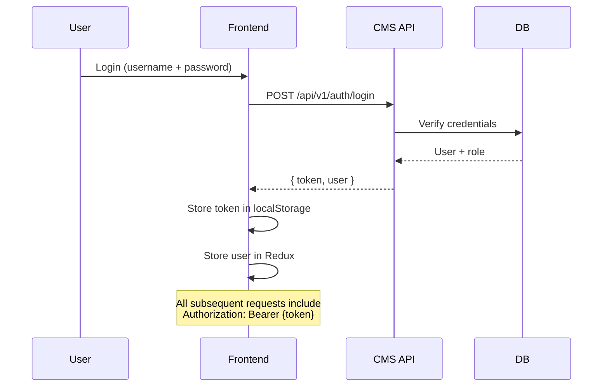

# NahSeHat Analytics Dashboard — Database Schema & API Endpoints

> Dokumen ini menjelaskan **struktur database CMS** dan **endpoint API** berdasarkan analisis frontend codebase.
>
> **⚠️ Arsitektur Penting:** Database ini HANYA menyimpan data yang dimiliki CMS Dashboard (users, roles, permissions, payors, settings, api_sources). Data dari service eksternal (Indemnity/DCSehat, ManageCare) di-fetch langsung dari API mereka saat runtime — tidak ada tabel lokal untuk claims, providers, members, icd10, atau daily_monitoring.

---

## 🏗️ Architecture Overview



### Data Ownership

| Data | Source | Stored Locally? | Reason |
|---|---|---|---|
| `users`, `roles`, `role_permissions` | CMS API (ours) | ✅ Yes | Dashboard owns this data |
| `payors`, `user_payors`, `settings` | CMS API (ours) | ✅ Yes | Dashboard owns this data |
| `api_sources` | CMS API (ours) | ✅ Yes | Dashboard config for external APIs |
| `claims`, `claim_details` | Indemnity API | ❌ No | Service has its own DB |
| `providers` | Derived from Indemnity API | ❌ No | Part of DCSehat response |
| `members` | Derived from Indemnity API | ❌ No | Part of DCSehat response |
| `icd10` | Derived from Indemnity API | ❌ No | Part of DCSehat response |
| `daily_monitoring` | ManageCare API | ❌ No | Service has its own DB |

---

## 📊 Entity Relationship Diagram



---

## 🗄️ Database Tables (CMS Only)

### 1. `users` — Manajemen User CMS

| Column | Type | Constraints | Description |
|---|---|---|---|
| `id` | `CHAR(36)` | PK, UUID | User ID |
| `username` | `VARCHAR(100)` | UNIQUE, NOT NULL | Login username |
| `email` | `VARCHAR(255)` | UNIQUE, NOT NULL | Email address |
| `password` | `VARCHAR(255)` | NOT NULL | Hashed password (bcrypt) |
| `full_name` | `VARCHAR(255)` | NOT NULL | Display name |
| `role` | `VARCHAR(50)` | NOT NULL, FK → `roles.name` | User role |
| `is_active` | `TINYINT(1)` | DEFAULT `1` | Active status |
| `created_at` | `TIMESTAMP` | DEFAULT `CURRENT_TIMESTAMP` | Creation timestamp |
| `updated_at` | `TIMESTAMP` | DEFAULT `CURRENT_TIMESTAMP ON UPDATE` | Last update timestamp |

### 2. `roles` — Role Definitions

| Column | Type | Constraints | Description |
|---|---|---|---|
| `id` | `CHAR(36)` | PK, UUID | Role ID |
| `name` | `VARCHAR(50)` | UNIQUE, NOT NULL | Role name (SUPER_ADMIN, ADMIN, INDEMNITY, MANAGECARE) |
| `description` | `TEXT` | NOT NULL | Role description |
| `created_at` | `TIMESTAMP` | DEFAULT `CURRENT_TIMESTAMP` | |
| `updated_at` | `TIMESTAMP` | DEFAULT `CURRENT_TIMESTAMP ON UPDATE` | |

**Seed Data:**
| name | description |
|---|---|
| `SUPER_ADMIN` | Full unrestricted system access & tenant administration |
| `ADMIN` | Operational manager with access to Indemnity, Manage Care & CMS Users |
| `INDEMNITY` | Specialist focused on claims utilization, demographics & disease analysis |
| `MANAGECARE` | Hospital officer monitoring daily admissions, discharges, and inpatient stay |

### 3. `role_permissions` — RBAC Permission Matrix

| Column | Type | Constraints | Description |
|---|---|---|---|
| `id` | `CHAR(36)` | PK, UUID | Permission ID |
| `role_id` | `CHAR(36)` | NOT NULL, FK → `roles.id` | Role reference |
| `menu` | `VARCHAR(100)` | NOT NULL | Menu/path identifier |
| `action` | `VARCHAR(20)` | NOT NULL, CHECK IN (create,read,update,delete,export) | Allowed action |

**Unique constraint:** `(role_id, menu, action)`

### 4. `payors` — Master Payor / Asuransi

| Column | Type | Constraints | Description |
|---|---|---|---|
| `id` | `CHAR(36)` | PK, UUID | Payor ID |
| `name` | `VARCHAR(255)` | NOT NULL | Payor name |
| `code` | `VARCHAR(50)` | UNIQUE, NOT NULL | Payor code (e.g. CH0022) |
| `description` | `TEXT` | | Description |
| `is_active` | `TINYINT(1)` | DEFAULT `1` | Active status |
| `created_at` | `TIMESTAMP` | DEFAULT `CURRENT_TIMESTAMP` | |
| `updated_at` | `TIMESTAMP` | DEFAULT `CURRENT_TIMESTAMP ON UPDATE` | |

### 5. `user_payors` — User ↔ Payor Assignment

| Column | Type | Constraints | Description |
|---|---|---|---|
| `user_id` | `CHAR(36)` | FK → `users.id`, ON DELETE CASCADE | User reference |
| `payor_id` | `CHAR(36)` | FK → `payors.id`, ON DELETE CASCADE | Payor reference |

**Primary Key:** `(user_id, payor_id)`

### 6. `settings` — Application Configuration

| Column | Type | Constraints | Description |
|---|---|---|---|
| `id` | `CHAR(36)` | PK, UUID | Setting ID |
| `key` | `VARCHAR(100)` | UNIQUE, NOT NULL | Setting key |
| `value` | `TEXT` | NOT NULL | Setting value |
| `category` | `VARCHAR(50)` | NOT NULL | Category grouping |
| `description` | `TEXT` | | Human-readable description |

### 7. `api_sources` — External API Configuration 🆕

| Column | Type | Constraints | Description |
|---|---|---|---|
| `id` | `CHAR(36)` | PK, UUID | Source ID |
| `name` | `VARCHAR(100)` | UNIQUE, NOT NULL | Service name (e.g. indemnity, managecare, cms) |
| `base_url` | `VARCHAR(500)` | NOT NULL | API base URL |
| `api_key` | `VARCHAR(500)` | | Encrypted API key (if required) |
| `is_active` | `TINYINT(1)` | DEFAULT `1` | Active status |
| `description` | `TEXT` | | Service description |
| `created_at` | `TIMESTAMP` | DEFAULT `CURRENT_TIMESTAMP` | |
| `updated_at` | `TIMESTAMP` | DEFAULT `CURRENT_TIMESTAMP ON UPDATE` | |

**Seed Data:**
| name | base_url | description |
|---|---|---|
| `indemnity` | `https://repi-api-.../api/v3` | Indemnity / DCSehat claims data service |
| `managecare` | `https://repi-api-.../api/v3` | ManageCare daily monitoring service |
| `cms` | `https://repi-api-.../api/v1` | CMS backend (auth, users, roles, permissions, payors, settings) |

---

## 🔌 API Endpoints

### Auth Endpoints (`/api/v1/auth/*`)

| Method | Path | Description | Request | Response |
|---|---|---|---|---|
| `POST` | `/api/v1/auth/login` | Login user | `{ username, password }` | `{ token, user }` |
| `POST` | `/api/v1/auth/logout` | Logout user | — | `{ success: true }` |
| `GET` | `/api/v1/auth/me` | Get current user | — | `{ user }` |
| `POST` | `/api/v1/auth/refresh` | Refresh token | `{ refreshToken }` | `{ token }` |

### CMS Endpoints (`/api/v1/*`)

| Method | Path | Description | Request | Response |
|---|---|---|---|---|
| `GET` | `/api/v1/users` | List users (paginated) | `?page=1&pageSize=20&search=&role=&isActive=` | `{ data: User[], total, page, pageSize }` |
| `POST` | `/api/v1/users` | Create user | `{ username, email, password, fullName, role, payorIds }` | `{ user }` |
| `GET` | `/api/v1/users/:id` | Get user by ID | — | `{ user }` |
| `PUT` | `/api/v1/users/:id` | Update user | `{ fullName?, email?, role?, isActive? }` | `{ user }` |
| `DELETE` | `/api/v1/users/:id` | Delete user | — | `{ success: true }` |
| `GET` | `/api/v1/roles` | List roles | — | `{ data: Role[] }` |
| `POST` | `/api/v1/roles` | Create role | `{ name, description }` | `{ role }` |
| `PUT` | `/api/v1/roles/:id` | Update role | `{ name?, description? }` | `{ role }` |
| `DELETE` | `/api/v1/roles/:id` | Delete role | — | `{ success: true }` |
| `GET` | `/api/v1/permissions` | List permissions | `?roleId=` | `{ data: Permission[] }` |
| `PUT` | `/api/v1/permissions/:roleId` | Update permissions | `{ permissions: [{ menu, action }] }` | `{ permissions }` |
| `GET` | `/api/v1/payors` | List payors | — | `{ data: Payor[] }` |
| `POST` | `/api/v1/payors` | Create payor | `{ name, code, description, isActive }` | `{ payor }` |
| `PUT` | `/api/v1/payors/:id` | Update payor | `{ name?, code?, description?, isActive? }` | `{ payor }` |
| `DELETE` | `/api/v1/payors/:id` | Delete payor | — | `{ success: true }` |
| `GET` | `/api/v1/settings` | List settings | `?category=` | `{ data: Setting[] }` |
| `PUT` | `/api/v1/settings/:key` | Update setting | `{ value }` | `{ setting }` |

### Indemnity Endpoints (`/api/v3/DCSehat`)

| Method | Path | Description | Response |
|---|---|---|---|
| `GET` | `/api/v3/DCSehat` | Get all DCSehat claims data | `{ data: DCSehatEntry[] }` |

**Response shape (transformed client-side):**
```typescript
interface ClaimsApiResponse {
  claims: Claim[];
  claimDetails: ClaimDetail[];
  providers: Provider[];
  members: Member[];
  icd10: Icd10[];
}
```

### ManageCare Endpoints (`/api/v3/dailyMonitoring`)

| Method | Path | Description | Request | Response |
|---|---|---|---|---|
| `POST` | `/api/v3/dailyMonitoring` | Get daily monitoring data | `{ payor_code, start_date, end_date }` | `{ data: DailyMonitoringItem[] }` |

---

## 📋 TypeScript Type Definitions

### CMS Types (Dashboard-owned)

```typescript
// ─── Auth ───
interface LoginRequest {
  username: string;
  password: string;
}
interface LoginResponse {
  token: string;
  user: User;
}

// ─── User ───
interface User {
  id: string;
  username: string;
  email: string;
  full_name: string;
  role: string;
  is_active: boolean;
  payorIds?: string[];
  created_at: string;
  updated_at: string;
}

// ─── Role ───
interface Role {
  id: string;
  name: string;
  description: string;
  created_at: string;
  updated_at: string;
}

// ─── Permission ───
interface Permission {
  id: string;
  role_id: string;
  menu: string;
  action: 'create' | 'read' | 'update' | 'delete' | 'export';
}

// ─── Payor ───
interface Payor {
  id: string;
  name: string;
  code: string;
  description: string;
  is_active: boolean;
  created_at: string;
  updated_at: string;
}

// ─── Setting ───
interface Setting {
  id: string;
  key: string;
  value: string;
  category: string;
  description: string;
}

// ─── API Source (NEW) ───
interface ApiSource {
  id: string;
  name: string;
  base_url: string;
  api_key?: string;
  is_active: boolean;
  description?: string;
  created_at: string;
  updated_at: string;
}
```

### External Data Types (fetched from APIs, NOT stored locally)

```typescript
// ─── Indemnity / DCSehat (from external API) ───
interface Claim {
  id: number;
  PAYORID: string;
  CLIENTID: string;
  PROVIDERID: string;
  CARDNO: string;
  CLAIMNO: string;
  CLAIMTYPE: string;      // 'M' | 'R'
  STATUS: string;
  POLICYNO: string;
  EMPID: string;
  BRANCH: string;
  MEMBERNO: string;
  NAME: string;
  GENDER: string;         // 'M' | 'F'
  AGE: string;
  ADMISSIONDATE: string;  // DDMMYYYY
  DISCHARGEDATE: string;  // DDMMYYYY
  DURATION: string;
  COVERAGEID: string;
  PPLAN: string;
  DISABILITY: string;
  FDIAGNOSIS: string;
  LDIAGNOSIS: string;
  FDIAGNOSISDESC: string;
  RELATIONSHIP: string;
  INCURRED: number;
  APPROVED: number;
  UNAPPROVED: number;
  ASOAPPROVED: number;
  HIGHPLAN: string;
  REMARKS: string;
  EXCESS: number;
  providerName: string;
  INVOICENO: string;
  HOSPITALINVOICEDATE: string;
  HOSPITALINVOICENO: string;
  RECEIVEDDATE: string;
  SUBMISSIONDATE: string;
  VERIFIEDBY: string;
  PHYSICIANID: string;
  PAYMENTDATE: string;
  created_at: string;
}

interface ClaimDetail {
  CLAIMNO: string;
  BENEFITID: string;
  BENEFITDESC: string;
  INCURRED: number;
  APPROVED: number;
  UNAPPROVED: number;
  EXCESS: number;
}

interface Provider {
  PROVIDERID: string;
  providerName: string;
  type: string;           // 'RS' | 'Klinik' | 'Lab' | 'Klinik Gigi' | 'Apotek'
  city: string;
  province: string;
  lat: number;
  lng: number;
  inNetwork: boolean;
}

interface Member {
  MEMBERNO: string;
  name: string;
  gender: string;
  birthDate: string;
  relationship: string;
  joinDate: string;
  active: boolean;
  age?: number;
}

interface Icd10 {
  code: string;
  description: string;
  group: string;
}

// ─── ManageCare (from external API) ───
interface DailyMonitoringHeader {
  ClaimStatus: 'DMO' | 'DHC' | 'REJECT' | string;
  ProviderID?: string;
  ProviderName?: string;
  AdmissionDate?: string;
  ICDXDesc?: string;
  MemberID?: string;
  MemberName?: string;
  PD?: 'P' | 'D' | string;
  Days?: number;
}

interface DailyMonitoringItem {
  header: DailyMonitoringHeader;
  [key: string]: unknown;
}

interface DailyMonitoringResponse {
  data: DailyMonitoringItem[];
  code?: number;
  success?: boolean;
}
```

---

## 🔐 Authentication & Authorization

### JWT Auth Flow



### RBAC Hierarchy

```
SUPER_ADMIN  → Full access (all menus, all actions)
    ↓
ADMIN        → Dashboard + Indemnity + ManageCare + CMS (limited delete)
    ↓
INDEMNITY    → Dashboard + Indemnity pages (read + export only)
    ↓
MANAGECARE   → Dashboard + ManageCare pages (read + update)
```

---

## 📁 SQL Files

| File | Purpose | Compatibility |
|---|---|---|
| `database/nahsehat_analytics_dash_mariadb.sql` | Full schema + seed data | MariaDB 10.4+ / MySQL 5.7+ |
| `database/nahsehat_analytics_dash_mysql.sql` | Full schema + seed data | MySQL 8.0+ / MariaDB 10.5+ |

### Import Commands

```bash
# MariaDB / XAMPP
/Applications/XAMPP/xamppfiles/bin/mysql -u root < database/nahsehat_analytics_dash_mariadb.sql

# MySQL 8.0+
mysql -u root -p < database/nahsehat_analytics_dash_mysql.sql
```

---

## 📊 Database Summary

| Table | Rows | Source | Owned by Dashboard? |
|---|---|---|---|
| `users` | 0 | CMS API | ✅ Yes |
| `roles` | 4 | CMS API | ✅ Yes |
| `role_permissions` | 26 | CMS API | ✅ Yes |
| `payors` | 5 | CMS API | ✅ Yes |
| `user_payors` | 0 | CMS API | ✅ Yes |
| `settings` | 6 | CMS API | ✅ Yes |
| `api_sources` | 3 | CMS API | ✅ Yes (NEW) |
| ~~`providers`~~ | — | Indemnity API | ❌ Removed |
| ~~`members`~~ | — | Indemnity API | ❌ Removed |
| ~~`icd10`~~ | — | Indemnity API | ❌ Removed |
| ~~`claims`~~ | — | Indemnity API | ❌ Removed |
| ~~`claim_details`~~ | — | Indemnity API | ❌ Removed |
| ~~`daily_monitoring`~~ | — | ManageCare API | ❌ Removed |

**Total: 7 tables (down from 12)** — only CMS-owned data stored locally.